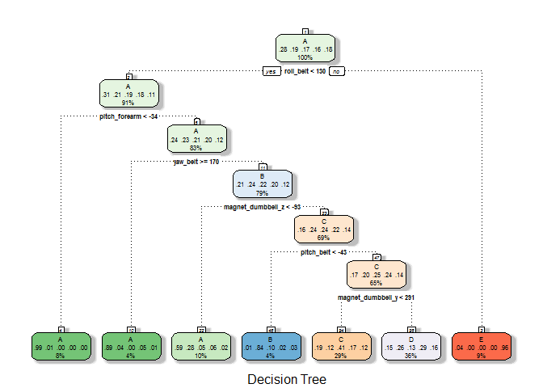
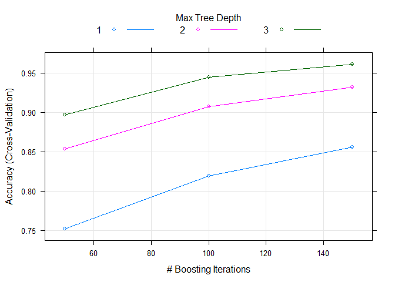
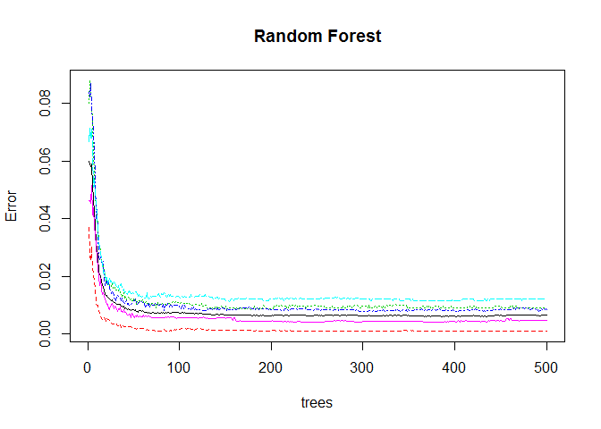

# 1 - Executive Summary

This report presents **three supervised machine learning models** - *Decision Tree, Gradient Boosting and Random Forest* - built on data from accelerometers on the belt, forearm, arm, and dumbell of 6 participants. They were asked to perform barbell lifts correctly and incorrectly in 5 different ways. More information is available from the website here: http://groupware.les.inf.puc-rio.br/har (see the section on the Weight Lifting Exercise Dataset).

The models predict in which of the 5 different ways a barbell lift was performed, which correspond to the 5 levels of the response variable "classe" in the training data set. The training data set has labeled data and the testing data set for the Prediction Quiz has unlabeled data. The model built with the **Random Forest** algorithm has the **highest accuracy** on the validation data set and was therefore selected for predicting the classes in the testing data set.

# 2 - Data processing

## 2.1 - Data importing


```r
pml_train <- read.csv("pml-training.csv")
pml_test <- read.csv("pml-testing.csv")
dim(pml_train)
```

```
## [1] 19622   160
```

```r
dim(pml_test)
```

```
## [1]  20 160
```

## 2.2 - Data cleaning

### 2.2.1 - Remove variables with NAs


```r
# Count the number of NAs per variable in the testing data
sum_na <- colSums(is.na(pml_test))
length(sum_na)
```

```
## [1] 160
```

```r
sum_na[1:15]
```

```
##                    X            user_name raw_timestamp_part_1 
##                    0                    0                    0 
## raw_timestamp_part_2       cvtd_timestamp           new_window 
##                    0                    0                    0 
##           num_window            roll_belt           pitch_belt 
##                    0                    0                    0 
##             yaw_belt     total_accel_belt   kurtosis_roll_belt 
##                    0                    0                   20 
##  kurtosis_picth_belt    kurtosis_yaw_belt   skewness_roll_belt 
##                   20                   20                   20
```

```r
# Identify the indexes of variables without NAs in the testing data
indexes_col_not_na <- which(sum_na==0)
length(indexes_col_not_na)
```

```
## [1] 60
```

```r
indexes_col_not_na[1:15]
```

```
##                    X            user_name raw_timestamp_part_1 
##                    1                    2                    3 
## raw_timestamp_part_2       cvtd_timestamp           new_window 
##                    4                    5                    6 
##           num_window            roll_belt           pitch_belt 
##                    7                    8                    9 
##             yaw_belt     total_accel_belt         gyros_belt_x 
##                   10                   11                   37 
##         gyros_belt_y         gyros_belt_z         accel_belt_x 
##                   38                   39                   40
```

```r
# The training data will now consist of the same variables
pml_train <- pml_train[,indexes_col_not_na]
dim(pml_train)
```

```
## [1] 19622    60
```

```r
# Check if there are NAs
unique(colSums(is.na(pml_train)))
```

```
## [1] 0
```

```r
# Only the response variable in the training data has a different name
colnames(pml_train)[60]
```

```
## [1] "classe"
```

```r
colnames(pml_test[,indexes_col_not_na])[60]
```

```
## [1] "problem_id"
```

```r
identical(colnames(pml_train)[1:59],colnames(pml_test[,indexes_col_not_na])[1:59])
```

```
## [1] TRUE
```

### 2.2.2 - Remove variables with irrelevant information for training the models


```r
str(pml_train)
```

```
## 'data.frame':	19622 obs. of  60 variables:
##  $ X                   : int  1 2 3 4 5 6 7 8 9 10 ...
##  $ user_name           : Factor w/ 6 levels "adelmo","carlitos",..: 2 2 2 2 2 2 2 2 2 2 ...
##  $ raw_timestamp_part_1: int  1323084231 1323084231 1323084231 1323084232 1323084232 1323084232 1323084232 1323084232 1323084232 1323084232 ...
##  $ raw_timestamp_part_2: int  788290 808298 820366 120339 196328 304277 368296 440390 484323 484434 ...
##  $ cvtd_timestamp      : Factor w/ 20 levels "02/12/2011 13:32",..: 9 9 9 9 9 9 9 9 9 9 ...
##  $ new_window          : Factor w/ 2 levels "no","yes": 1 1 1 1 1 1 1 1 1 1 ...
##  $ num_window          : int  11 11 11 12 12 12 12 12 12 12 ...
##  $ roll_belt           : num  1.41 1.41 1.42 1.48 1.48 1.45 1.42 1.42 1.43 1.45 ...
##  $ pitch_belt          : num  8.07 8.07 8.07 8.05 8.07 8.06 8.09 8.13 8.16 8.17 ...
##  $ yaw_belt            : num  -94.4 -94.4 -94.4 -94.4 -94.4 -94.4 -94.4 -94.4 -94.4 -94.4 ...
##  $ total_accel_belt    : int  3 3 3 3 3 3 3 3 3 3 ...
##  $ gyros_belt_x        : num  0 0.02 0 0.02 0.02 0.02 0.02 0.02 0.02 0.03 ...
##  $ gyros_belt_y        : num  0 0 0 0 0.02 0 0 0 0 0 ...
##  $ gyros_belt_z        : num  -0.02 -0.02 -0.02 -0.03 -0.02 -0.02 -0.02 -0.02 -0.02 0 ...
##  $ accel_belt_x        : int  -21 -22 -20 -22 -21 -21 -22 -22 -20 -21 ...
##  $ accel_belt_y        : int  4 4 5 3 2 4 3 4 2 4 ...
##  $ accel_belt_z        : int  22 22 23 21 24 21 21 21 24 22 ...
##  $ magnet_belt_x       : int  -3 -7 -2 -6 -6 0 -4 -2 1 -3 ...
##  $ magnet_belt_y       : int  599 608 600 604 600 603 599 603 602 609 ...
##  $ magnet_belt_z       : int  -313 -311 -305 -310 -302 -312 -311 -313 -312 -308 ...
##  $ roll_arm            : num  -128 -128 -128 -128 -128 -128 -128 -128 -128 -128 ...
##  $ pitch_arm           : num  22.5 22.5 22.5 22.1 22.1 22 21.9 21.8 21.7 21.6 ...
##  $ yaw_arm             : num  -161 -161 -161 -161 -161 -161 -161 -161 -161 -161 ...
##  $ total_accel_arm     : int  34 34 34 34 34 34 34 34 34 34 ...
##  $ gyros_arm_x         : num  0 0.02 0.02 0.02 0 0.02 0 0.02 0.02 0.02 ...
##  $ gyros_arm_y         : num  0 -0.02 -0.02 -0.03 -0.03 -0.03 -0.03 -0.02 -0.03 -0.03 ...
##  $ gyros_arm_z         : num  -0.02 -0.02 -0.02 0.02 0 0 0 0 -0.02 -0.02 ...
##  $ accel_arm_x         : int  -288 -290 -289 -289 -289 -289 -289 -289 -288 -288 ...
##  $ accel_arm_y         : int  109 110 110 111 111 111 111 111 109 110 ...
##  $ accel_arm_z         : int  -123 -125 -126 -123 -123 -122 -125 -124 -122 -124 ...
##  $ magnet_arm_x        : int  -368 -369 -368 -372 -374 -369 -373 -372 -369 -376 ...
##  $ magnet_arm_y        : int  337 337 344 344 337 342 336 338 341 334 ...
##  $ magnet_arm_z        : int  516 513 513 512 506 513 509 510 518 516 ...
##  $ roll_dumbbell       : num  13.1 13.1 12.9 13.4 13.4 ...
##  $ pitch_dumbbell      : num  -70.5 -70.6 -70.3 -70.4 -70.4 ...
##  $ yaw_dumbbell        : num  -84.9 -84.7 -85.1 -84.9 -84.9 ...
##  $ total_accel_dumbbell: int  37 37 37 37 37 37 37 37 37 37 ...
##  $ gyros_dumbbell_x    : num  0 0 0 0 0 0 0 0 0 0 ...
##  $ gyros_dumbbell_y    : num  -0.02 -0.02 -0.02 -0.02 -0.02 -0.02 -0.02 -0.02 -0.02 -0.02 ...
##  $ gyros_dumbbell_z    : num  0 0 0 -0.02 0 0 0 0 0 0 ...
##  $ accel_dumbbell_x    : int  -234 -233 -232 -232 -233 -234 -232 -234 -232 -235 ...
##  $ accel_dumbbell_y    : int  47 47 46 48 48 48 47 46 47 48 ...
##  $ accel_dumbbell_z    : int  -271 -269 -270 -269 -270 -269 -270 -272 -269 -270 ...
##  $ magnet_dumbbell_x   : int  -559 -555 -561 -552 -554 -558 -551 -555 -549 -558 ...
##  $ magnet_dumbbell_y   : int  293 296 298 303 292 294 295 300 292 291 ...
##  $ magnet_dumbbell_z   : num  -65 -64 -63 -60 -68 -66 -70 -74 -65 -69 ...
##  $ roll_forearm        : num  28.4 28.3 28.3 28.1 28 27.9 27.9 27.8 27.7 27.7 ...
##  $ pitch_forearm       : num  -63.9 -63.9 -63.9 -63.9 -63.9 -63.9 -63.9 -63.8 -63.8 -63.8 ...
##  $ yaw_forearm         : num  -153 -153 -152 -152 -152 -152 -152 -152 -152 -152 ...
##  $ total_accel_forearm : int  36 36 36 36 36 36 36 36 36 36 ...
##  $ gyros_forearm_x     : num  0.03 0.02 0.03 0.02 0.02 0.02 0.02 0.02 0.03 0.02 ...
##  $ gyros_forearm_y     : num  0 0 -0.02 -0.02 0 -0.02 0 -0.02 0 0 ...
##  $ gyros_forearm_z     : num  -0.02 -0.02 0 0 -0.02 -0.03 -0.02 0 -0.02 -0.02 ...
##  $ accel_forearm_x     : int  192 192 196 189 189 193 195 193 193 190 ...
##  $ accel_forearm_y     : int  203 203 204 206 206 203 205 205 204 205 ...
##  $ accel_forearm_z     : int  -215 -216 -213 -214 -214 -215 -215 -213 -214 -215 ...
##  $ magnet_forearm_x    : int  -17 -18 -18 -16 -17 -9 -18 -9 -16 -22 ...
##  $ magnet_forearm_y    : num  654 661 658 658 655 660 659 660 653 656 ...
##  $ magnet_forearm_z    : num  476 473 469 469 473 478 470 474 476 473 ...
##  $ classe              : Factor w/ 5 levels "A","B","C","D",..: 1 1 1 1 1 1 1 1 1 1 ...
```

```r
# The first 7 variables will be removed
pml_train <- pml_train[,-c(1:7)]
dim(pml_train)
```

```
## [1] 19622    53
```

## 2.3 - Create training (80%) and validation (20%) data sets


```r
library(caret)
```

```
## Loading required package: lattice
```

```
## Loading required package: ggplot2
```

```r
set.seed(12300)
in_train <- createDataPartition(y=pml_train$classe,p=0.8,list=FALSE)
pml_training <- pml_train[in_train,]
pml_validation <- pml_train[-in_train,]
dim(pml_training)
```

```
## [1] 15699    53
```

```r
dim(pml_validation)
```

```
## [1] 3923   53
```

```r
nrow(pml_training)+nrow(pml_validation)==nrow(pml_train)
```

```
## [1] TRUE
```

# 3 - Supervised Machine Learning Algorithms

## 3.1 - Decision Tree


```r
train_ctrl <- trainControl(method="repeatedcv",
                           number=10, # 10-fold cross validation 
                           repeats=3 # Repeated 3 times
                           )

mod_dt <- train(classe~.,method="rpart",data=pml_training,
                trControl=train_ctrl)

library(rattle)
```

```
## Rattle: A free graphical interface for data science with R.
## Version 5.2.0 Copyright (c) 2006-2018 Togaware Pty Ltd.
## Type 'rattle()' to shake, rattle, and roll your data.
```

```r
fancyRpartPlot(mod_dt$finalModel,caption="Decision Tree")
```

<!-- -->

```r
mod_dt_predictions <- predict(mod_dt,newdata=pml_validation)
mod_dt_cm <- confusionMatrix(mod_dt_predictions,pml_validation$classe)
mod_dt_cm
```

```
## Confusion Matrix and Statistics
## 
##           Reference
## Prediction   A   B   C   D   E
##          A 681 121  16  25  11
##          B   3 150  14   6   4
##          C 208 115 443 196 135
##          D 201 373 211 416 234
##          E  23   0   0   0 337
## 
## Overall Statistics
##                                           
##                Accuracy : 0.5167          
##                  95% CI : (0.5009, 0.5324)
##     No Information Rate : 0.2845          
##     P-Value [Acc > NIR] : < 2.2e-16       
##                                           
##                   Kappa : 0.3987          
##  Mcnemar's Test P-Value : < 2.2e-16       
## 
## Statistics by Class:
## 
##                      Class: A Class: B Class: C Class: D Class: E
## Sensitivity            0.6102  0.19763   0.6477   0.6470  0.46741
## Specificity            0.9384  0.99147   0.7981   0.6893  0.99282
## Pos Pred Value         0.7974  0.84746   0.4038   0.2899  0.93611
## Neg Pred Value         0.8583  0.83743   0.9147   0.9088  0.89223
## Prevalence             0.2845  0.19347   0.1744   0.1639  0.18379
## Detection Rate         0.1736  0.03824   0.1129   0.1060  0.08590
## Detection Prevalence   0.2177  0.04512   0.2796   0.3658  0.09177
## Balanced Accuracy      0.7743  0.59455   0.7229   0.6681  0.73011
```

## 3.2 - Gradient Boosting


```r
mod_gbm <- train(classe~.,method="gbm",data=pml_training,
                 trControl=trainControl(method="cv",
                                        number=5 # 5-fold cross validation
                                        ),verbose=FALSE)
mod_gbm
```

```
## Stochastic Gradient Boosting 
## 
## 15699 samples
##    52 predictor
##     5 classes: 'A', 'B', 'C', 'D', 'E' 
## 
## No pre-processing
## Resampling: Cross-Validated (5 fold) 
## Summary of sample sizes: 12560, 12560, 12558, 12558, 12560 
## Resampling results across tuning parameters:
## 
##   interaction.depth  n.trees  Accuracy   Kappa    
##   1                   50      0.7520866  0.6856259
##   1                  100      0.8193513  0.7713341
##   1                  150      0.8555956  0.8172416
##   2                   50      0.8534300  0.8142720
##   2                  100      0.9071274  0.8824786
##   2                  150      0.9318425  0.9137528
##   3                   50      0.8967447  0.8693051
##   3                  100      0.9443909  0.9296398
##   3                  150      0.9612075  0.9509192
## 
## Tuning parameter 'shrinkage' was held constant at a value of 0.1
## 
## Tuning parameter 'n.minobsinnode' was held constant at a value of 10
## Accuracy was used to select the optimal model using the largest value.
## The final values used for the model were n.trees = 150,
##  interaction.depth = 3, shrinkage = 0.1 and n.minobsinnode = 10.
```

```r
plot(mod_gbm)
```

<!-- -->

```r
mod_gbm_predictions <- predict(mod_gbm,newdata=pml_validation)
mod_gbm_cm <- confusionMatrix(mod_gbm_predictions,pml_validation$classe)
mod_gbm_cm
```

```
## Confusion Matrix and Statistics
## 
##           Reference
## Prediction    A    B    C    D    E
##          A 1099   25    0    2    0
##          B   13  709   21    3    7
##          C    1   23  649   23    5
##          D    2    1   13  611   19
##          E    1    1    1    4  690
## 
## Overall Statistics
##                                          
##                Accuracy : 0.9579         
##                  95% CI : (0.9512, 0.964)
##     No Information Rate : 0.2845         
##     P-Value [Acc > NIR] : < 2.2e-16      
##                                          
##                   Kappa : 0.9468         
##  Mcnemar's Test P-Value : 0.003004       
## 
## Statistics by Class:
## 
##                      Class: A Class: B Class: C Class: D Class: E
## Sensitivity            0.9848   0.9341   0.9488   0.9502   0.9570
## Specificity            0.9904   0.9861   0.9839   0.9893   0.9978
## Pos Pred Value         0.9760   0.9416   0.9258   0.9458   0.9900
## Neg Pred Value         0.9939   0.9842   0.9891   0.9902   0.9904
## Prevalence             0.2845   0.1935   0.1744   0.1639   0.1838
## Detection Rate         0.2801   0.1807   0.1654   0.1557   0.1759
## Detection Prevalence   0.2870   0.1919   0.1787   0.1647   0.1777
## Balanced Accuracy      0.9876   0.9601   0.9664   0.9698   0.9774
```

## 3.3 - Random Forest


```r
mod_rf <- train(classe~.,method="rf",data=pml_training,
                 trControl=trainControl(method="cv",
                                        number=5 # 5-fold cross validation
                                        ))
mod_rf
```

```
## Random Forest 
## 
## 15699 samples
##    52 predictor
##     5 classes: 'A', 'B', 'C', 'D', 'E' 
## 
## No pre-processing
## Resampling: Cross-Validated (5 fold) 
## Summary of sample sizes: 12561, 12558, 12558, 12560, 12559 
## Resampling results across tuning parameters:
## 
##   mtry  Accuracy   Kappa    
##    2    0.9911459  0.9887986
##   27    0.9912737  0.9889605
##   52    0.9871971  0.9838038
## 
## Accuracy was used to select the optimal model using the largest value.
## The final value used for the model was mtry = 27.
```

```r
plot(mod_rf$finalModel,main="Random Forest")
```

<!-- -->

```r
mod_rf_predictions <- predict(mod_rf,newdata=pml_validation)
mod_rf_cm <- confusionMatrix(mod_rf_predictions,pml_validation$classe)
mod_rf_cm
```

```
## Confusion Matrix and Statistics
## 
##           Reference
## Prediction    A    B    C    D    E
##          A 1115    5    0    0    0
##          B    1  750    3    0    0
##          C    0    4  676    5    1
##          D    0    0    5  637    7
##          E    0    0    0    1  713
## 
## Overall Statistics
##                                           
##                Accuracy : 0.9918          
##                  95% CI : (0.9885, 0.9944)
##     No Information Rate : 0.2845          
##     P-Value [Acc > NIR] : < 2.2e-16       
##                                           
##                   Kappa : 0.9897          
##  Mcnemar's Test P-Value : NA              
## 
## Statistics by Class:
## 
##                      Class: A Class: B Class: C Class: D Class: E
## Sensitivity            0.9991   0.9881   0.9883   0.9907   0.9889
## Specificity            0.9982   0.9987   0.9969   0.9963   0.9997
## Pos Pred Value         0.9955   0.9947   0.9854   0.9815   0.9986
## Neg Pred Value         0.9996   0.9972   0.9975   0.9982   0.9975
## Prevalence             0.2845   0.1935   0.1744   0.1639   0.1838
## Detection Rate         0.2842   0.1912   0.1723   0.1624   0.1817
## Detection Prevalence   0.2855   0.1922   0.1749   0.1654   0.1820
## Balanced Accuracy      0.9987   0.9934   0.9926   0.9935   0.9943
```

# 4 - Model selection


```r
mod_accuracy <- rbind("Decision Tree"=mod_dt_cm$overall[1],
                      "Gradient Boosting"=mod_gbm_cm$overall[1],
                      "Random Forest"=mod_rf_cm$overall[1])
mod_accuracy
```

```
##                    Accuracy
## Decision Tree     0.5166964
## Gradient Boosting 0.9579404
## Random Forest     0.9918430
```

**The model with the highest accuracy on the validation data is the mod_rf model, built with the Random Forest algorithm, and will be selected for predicting the classes in the testing data set.**

## 4.1 - Expected out of sample error


```r
1-mod_rf_cm$overall[1]
```

```
##    Accuracy 
## 0.008157023
```

```r
paste("The expected out of sample error is",round((1-mod_rf_cm$overall[1])*100,3),"%")
```

```
## [1] "The expected out of sample error is 0.816 %"
```

# 5 - Predictions on the testing data


```r
test_predictions <- predict(mod_rf,newdata=pml_test)
test_predictions
```

```
##  [1] B A B A A E D B A A B C B A E E A B B B
## Levels: A B C D E
```
